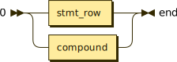
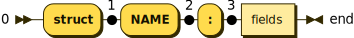

module ::= (statements | definition)* 'ENDMARKER'

definition ::= function | structure

statements ::= stmt_row | compound

stmt_row ::= (small | 'pass') (';' (small | 'pass'))* 'NEWLINE'

small ::= call_or_asg | return | 'break' | 'continue'

call_or_asg ::= designator (':' type)? ('=' expression)?

type ::= 'NAME'

return ::= 'return' (expression)?

compound ::= if | while

if ::= 'if' expression ':' suite ('elif' expression ':' suite)* ('else' ':' suite)?

while ::= 'while' expression ':' suite

suite ::= stmt_row | stmt_col

stmt_col ::= 'NEWLINE' 'INDENT' (statements)+ ''DEDENT'

function ::= 'def' 'NAME' '(' (parameters)? ')' ('->' type)? ':' suite

parameters ::= parameter (',' parameter)*

parameter ::= 'NAME' (':' type)?

expressions ::= expression (',' expression)*

expression ::= or

or ::= and ('or' and)*

and ::= not ('and' not)*

not ::= ('not' not) | comparison

comparison ::= bor (relation bor)*

relation ::= '<' | '>' | '==' | '<=' | '>=' | '!='

bor ::= bxor ('|' bxor)*

bxor ::= band ('^' band)*

band ::= shift ('&' shift)*

shift ::= arith (('<<' | '>>') arith)*

arith ::= term (('-' | '+') term)*

term ::= factor (('*' | '/' | '%' | '//') factor)*

factor ::= power | (('+' | '-' | '~') factor)

power ::= designator ('**' factor)?

designator ::= atom (selector)*

atom ::= list | 'NAME' | 'NUMBER' | 'True' | 'False' | 'None' | ('(' expression ')')

selector ::= ('(' expressions? ')')
           | ('[' expressions ']')
           | ('.' 'NAME')

list ::= '[' expressions? ']'

structure ::= 'struct' 'NAME' ':' fields

fields ::= field_row | field_col

field_row ::= field (';' (field | pass))* 'NEWLINE'

field_col ::= 'NEWLINE' 'INDENT' field_row field_row* 'DEDENT'

field ::= 'NAME' (':' type)? ('=' expression)?

